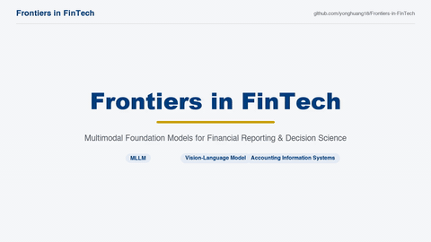
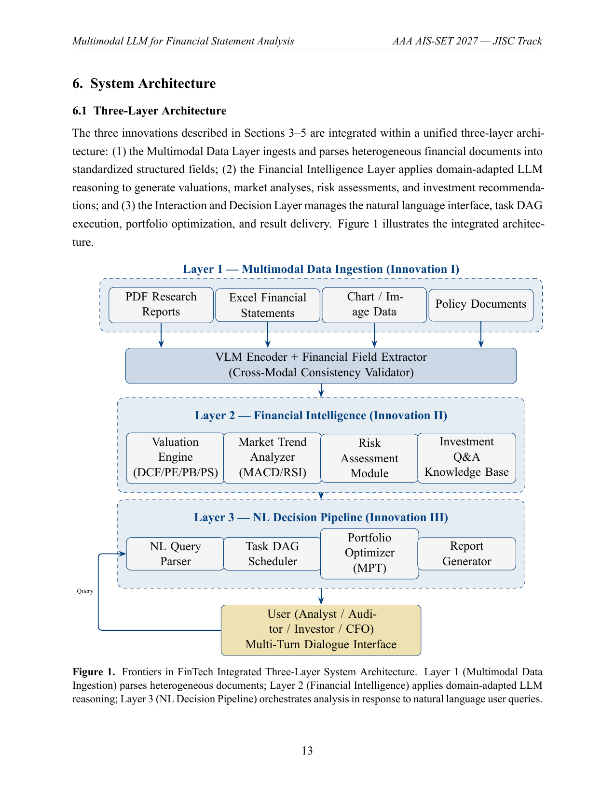

<h1 align="center">Frontiers in FinTech</h1>
<p align="center">
  <em>Multimodal Foundation Models for Financial Reporting and Decision Science</em>
</p>
<p align="center">
  <a href="https://github.com/yonghuang18/Frontiers-in-FinTech/blob/main/LICENSE"></a>
  <a href="https://creativecommons.org/licenses/by/4.0/"></a>
  
  
  <a href="paper/Frontiers_in_FinTech.pdf"></a>
  
  
  
  
</p>

> **Frontiers in FinTech** is a multimodal large language model (MLLM) system that
> integrates Vision-Language Model (VLM) technology with domain-specific
> financial reasoning to deliver end-to-end intelligent financial analysis —
> from heterogeneous document parsing, through valuation and risk modeling,
> to a natural-language query interface for accounting and investment
> professionals.

This repository accompanies the manuscript
*"Frontiers in FinTech: Multimodal Foundation Models for Financial Reporting
and Decision Science"* and provides the paper source, the headline results,
and a reference implementation architecture for the three-layer Frontiers in FinTech system.

<p align="center">
  
</p>

<p align="center">
  <sub>10-second dynamic system-flow teaser (loops inline) &middot; <a href="https://raw.githubusercontent.com/yuluhuang324/Frontiers-in-FinTech/main/assets/Frontiers_in_FinTech_demo.mp4">download MP4</a></sub>
</p>

---

## Highlights

| Task | Metric | Result | vs. Baseline |
|---|---|---|---|
| Cross-format document parsing (n=500) | Overall F₁ | **0.906** | **+17.6%** vs. text-only |
| Valuation accuracy (n=200) | MAE | **13.1%** | **−19%** vs. strongest baseline |
| Investment decision (n=200) | Direction accuracy | **0.751** | +4.8 pp vs. DCF spreadsheet |
| User study (n=48) | Time savings | **51.1%** | largest gains for non-specialists |

Full tables are available as CSV under [`results/`](results/).

## Three innovations

1. **Multimodal Financial Document Intelligence** *(§3)* — a VLM encoder
   parses PDF reports, Excel statements, chart images, and scanned policy
   documents into a unified 120-field GAAP/IFRS schema, with an automated
   **cross-modal consistency validator** that mirrors audit
   evidence-corroboration procedures.
2. **Domain-Adaptive Two-Stage LLM Training** *(§4)* — large-scale
   financial pre-training followed by institution-specific LoRA fine-tuning,
   encoding DCF / P-E / P-B / P-S / EV-EBITDA / residual-income models and
   GAAP-IFRS reporting logic.
3. **Natural-Language Query-Driven Decision Pipeline** *(§5)* — translates
   ambiguous user queries into an executable task DAG, integrating Markowitz
   portfolio optimization, real-time risk monitoring, and multi-turn
   dialogue refinement.

## Architecture

<p align="center">
  <br>
  <sub>Layer 1 — Multimodal Data Ingestion · Layer 2 — Financial Intelligence · Layer 3 — NL Decision Pipeline.</sub>
</p>

See [`docs/architecture.md`](docs/architecture.md) for a textual summary; the
`src/` package mirrors this layering one-to-one.

## Repository structure

```
Frontiers in FinTech/
├── paper/                      # manuscript (XeLaTeX) + compiled PDF + figure
│   ├── Frontiers_in_FinTech.tex
│   ├── Frontiers_in_FinTech.pdf
│   ├── LICENSE-paper.md        # CC-BY-4.0
│   └── figures/architecture.png
├── src/                        # three-layer reference architecture (stubs)
│   ├── data_ingestion/         # Layer 1  — VLM encoder, field extractor, validator
│   ├── intelligence/           # Layer 2  — valuation, market trend, risk, training
│   ├── decision/               # Layer 3  — NL parser, DAG, portfolio, report
│   └── pipeline.py             # end-to-end orchestrator
├── results/                    # headline result tables (CSV)
├── docs/architecture.md
├── requirements.txt            # intended production stack
├── CITATION.cff
└── LICENSE                     # MIT (code)
```

## Getting started

### Read the paper

The compiled manuscript is at
[`paper/Frontiers_in_FinTech.pdf`](paper/Frontiers_in_FinTech.pdf).
To rebuild from source (requires XeLaTeX and the Times New Roman font):

```bash
cd paper
xelatex Frontiers_in_FinTech.tex && xelatex Frontiers_in_FinTech.tex
```

If packages are missing (TinyTeX / TeX Live), install them once:

```bash
tlmgr install multirow caption natbib enumitem titlesec tcolorbox ragged2e pdfcol float
```

### Reference architecture

The `src/` modules are **architectural scaffolding** — they encode Frontiers in FinTech's
design and interface contracts and are **not** a runnable implementation.
Install the intended dependency stack and explore the interfaces:

```bash
pip install -r requirements.txt
python -c "from src.intelligence.risk import sharpe; print(sharpe.__doc__)"
```

## Citation

If you build on this work, please cite it:

```bibtex
@article{huang2026finvision,
  title   = {Frontiers in FinTech: Multimodal Foundation Models for
             Financial Reporting and Decision Science},
  author  = {Huang, Yulu and Yu, Niannian and Yang, Yaxin and Huang, Yong},
  year    = {2026},
  note    = {Manuscript, AAA AIS-SET 2027 -- JISC Track},
  url     = {https://github.com/yonghuang18/Frontiers-in-FinTech}
}
```

## Authors

- **Yulu Huang**¹·³, **Niannian Yu**¹, **Yaxin Yang**¹, **Yong Huang**²·³†
  († corresponding author)

¹ School of Accounting, Jiangxi University of Finance and Economics
² School of Electronic Information and Communications, Huazhong University of Science and Technology
³ Meituan

Contact: yonghuang18@alumni.hust.edu.cn

## License

- **Manuscript** (`paper/`): [CC-BY-4.0](https://creativecommons.org/licenses/by/4.0/) — see [`paper/LICENSE-paper.md`](paper/LICENSE-paper.md).
- **Code / architecture** (`src/`, `results/`, `docs/`): [MIT](LICENSE).
